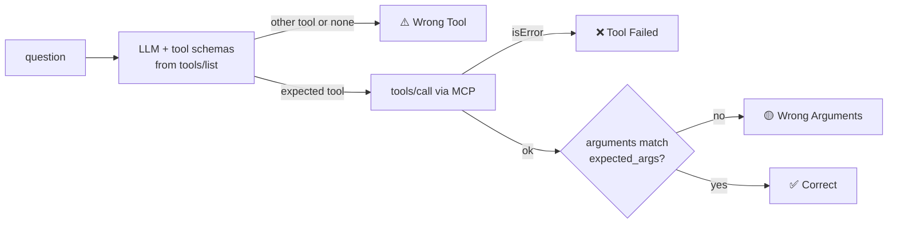

# GitHub MCP Server: Implementation Guide

Everything referenced here is real, runnable code in this folder:

```
github-mcp/
├── README.md                         ← the portfolio README (results table waits for your numbers)
├── GUIDE.md                          ← you are here
├── WINDOWS.md                        ← the same steps in PowerShell
├── REVIEW.md                         ← the project review and what changed because of it
├── pyproject.toml / LICENSE / Dockerfile
├── .env.example / .gitignore
├── claude_desktop_config.example.json (+ .docker.example.json)
├── src/github_mcp/
│   ├── server.py                     ← MCP server: 6 read-only tools
│   ├── descriptions.py               ← v1 (vague), v1b (ablation) and v2 (optimized) descriptions
│   └── github_client.py              ← GitHub REST client: retries, rate limits, ETags, pagination
├── eval/
│   ├── run_eval.py                   ← benchmark runner (select and agent modes)
│   ├── questions.jsonl               ← 60 questions, 10 per tool (train set)
│   ├── heldout.jsonl                 ← 20 questions never used for tuning
│   ├── agent_questions.jsonl         ← 13 multi-step questions with known answers
│   ├── backends.py / grading.py      ← Claude, Ollama and oracle backends; argument grading
│   ├── seed_data.py                  ← the benchmark repos, defined once
│   ├── seed_repos.py                 ← creates them as private repos in your account
│   ├── fake_github.py                ← serves them offline (no token needed)
│   ├── optimize.py                   ← automatic description optimizer with a held-out guard
│   └── plot_results.py               ← results chart for the README
└── tests/                            ← 52 offline tests (server, harness, data, seed script)
```

> **Built against `mcp` 2.3.** v2 of the SDK renamed `FastMCP` → `MCPServer`
> (`from mcp.server.mcpserver import MCPServer`), and tool objects use `input_schema` / `is_error`.

> **About the numbers.** The 64% / 22% / 14% baseline and 90%+ target come from the career guide.
> They are **illustrative targets, not results**. Publish what the harness measures.

---

## 1. Setup

```bash
git clone https://github.com/<you>/github-mcp.git && cd github-mcp
python3 -m venv .venv && source .venv/bin/activate
pip install -e '.[dev,eval,plot]'
pytest -q                                     # 52 offline tests, no token needed
python eval/run_eval.py --fake-github --backend oracle --toolset v2   # harness self-test: 100%
```

### Two tokens, two jobs

| Token | Used by | Permissions | Lifetime |
|---|---|---|---|
| `GITHUB_TOKEN` | the MCP server and the eval | Fine-grained, **read-only**: Metadata, Contents, Issues, Pull requests | 90 days |
| `GITHUB_SEED_TOKEN` | `eval/seed_repos.py` only, once | Fine-grained, **All repositories**, read and write: Administration, Contents, Issues, Pull requests | 1 day, delete after seeding |

Create both under GitHub → Settings → Developer settings → Personal access tokens → Fine-grained.
If the read-only token uses "Only select repositories", add `mcp-bench-app` and `mcp-bench-lib`
after seeding, or it won't see them.

```bash
cp .env.example .env && chmod 600 .env       # .env is gitignored
$EDITOR .env                                 # paste both tokens
```

### Create the benchmark repos (once)

```bash
python eval/seed_repos.py --dry-run          # prints the ~70 API calls it would make
python eval/seed_repos.py                    # creates two PRIVATE repos, takes about 2 minutes
```

It creates `mcp-bench-app` (Python, MIT) and `mcp-bench-lib` (TypeScript, ISC) with backdated
commits from two authors, 15 labelled issues (open and closed, some with comments) and 5 pull
requests (open, draft, merged, closed). Then set in `.env`:

```
EVAL_REPO=<you>/mcp-bench-app
EVAL_REPO2=<you>/mcp-bench-lib
```

Wait a minute before the first eval so GitHub's search index includes the new issues, then delete
`GITHUB_SEED_TOKEN` (on GitHub and in `.env`). Re-running the script skips repos that already
exist; to start over, delete the repo on GitHub first.

Why seed instead of using your own repos: every question then has a real, known answer (so the
agent eval can check answers), the numbers are reproducible by anyone, and the same data runs
offline through `--fake-github`.

### Inspect, then connect to Claude Desktop

```bash
npx @modelcontextprotocol/inspector .venv/bin/github-mcp
```

Claude Desktop → Settings → Developer → Edit Config (`claude_desktop_config.json`):

```json
{
  "mcpServers": {
    "github": {
      "command": "/ABSOLUTE/PATH/TO/github-mcp/.venv/bin/github-mcp",
      "env": { "GITHUB_TOKEN": "github_pat_...", "GITHUB_MCP_TOOLSET": "v2" }
    }
  }
}
```

Other ways to run it:
- **uvx, no clone:** `"command": "uvx", "args": ["--from", "git+https://github.com/<you>/github-mcp", "github-mcp"]`
- **Docker:** `docker build -t github-mcp .`, then use `claude_desktop_config.docker.example.json`.

The config file holds the token in plain text: never commit a filled-in copy. On macOS you can keep
it in the Keychain instead (`security add-generic-password -a "$USER" -s github-mcp -w "$GITHUB_TOKEN"`,
then a wrapper script that exports it).

---

## 2. The server

### The six tools

| Tool | GitHub endpoint | Designed-in confusion it tests |
|---|---|---|
| `list_repositories` | `GET /user/repos` (paged, with an exact total) | vs `get_repository` ("which repo has most stars?"), vs `search_issues` ("repos about ML") |
| `get_repository` | `GET /repos/{o}/{r}` | its `open_issues_count` **includes PRs**, a tempting wrong answer for "how many open issues" |
| `list_open_issues` | `GET /repos/{o}/{r}/issues?state=open` (paged, PRs dropped, exact total) | vs `search_issues` for keyword or closed-issue questions |
| `search_issues` | `GET /search/issues` scoped to `user:<you>` or `repo:` | v1 says "Searches GitHub", which lures repo-finding questions |
| `list_pull_requests` | `GET /repos/{o}/{r}/pulls` | vs `list_open_issues` (GitHub calls PRs issues too) and `get_recent_commits` |
| `get_recent_commits` | `GET /repos/{o}/{r}/commits` | v1 says "recent activity", overlapping with `pushed_at` in repo metadata |

### Three toolsets

| Toolset | Descriptions | Bare repo names (`my-app`) | Purpose |
|---|---|---|---|
| `v1` | deliberately vague ("Gets issues.") | rejected | baseline |
| `v1b` | same as v1 | accepted | ablation: isolates the input-handling fix |
| `v2` | what it returns, when to use it, when NOT (naming the alternative), parameter formats | accepted | optimized |

`v1 → v1b` measures the behaviour fix alone; `v1b → v2` measures the description rewrite alone.
Without `v1b`, a reviewer can fairly say the baseline was set up to fail: with an oracle that always
picks the right tool, v1 still scores 83%, because all 10 bare-name questions fail by design.

`GITHUB_MCP_TOOLSET` also accepts a path to a JSON file of the same shape, which is how
`eval/optimize.py` tests its candidates.

### Design details worth mentioning in interviews

- **Errors are written for the model.** Every failure becomes a `ToolError` whose text says what to
  do next ("Not found... Call list_repositories to check the exact name"), returned as
  `isError: true` so the model can recover. The server never crashes on a GitHub error.
- **Counts the model can trust.** List tools page through results and return `total`/`total_open`
  plus `total_is_exact`, separately from the `limit` items shown. Before this, "how many open
  issues" got `count: 20` (the page size) for a repo with 35.
- **Resilience:** exponential backoff with jitter on 5xx and network errors; primary and secondary
  rate limits handled (sleep if the reset is ≤ 10 s, otherwise fail fast with the reset time).
- **ETag caching:** repeat requests send `If-None-Match`; a `304 Not Modified` is served from cache
  and doesn't count against GitHub's rate limit.
- **Input forgiveness:** `owner/name`, a bare `name` (v1b/v2), `https://github.com/o/n`,
  `github.com/o/n/`, and `o/n.git` all resolve.
- **Least privilege twice:** a read-only token and `readOnlyHint` tool annotations.
- **stdout is the protocol;** logs go to stderr. `GITHUB_API_URL` points the server at GitHub
  Enterprise or the fake GitHub.
- **Testable by design:** the HTTP transport is injectable and the MCP SDK connects in-process, so
  tests run the real server against a fake GitHub in about a second.

---

## 3. The evaluation

### Select mode: does the model pick the right tool, with the right arguments?



Each question carries `expected_args`, graded by `eval/grading.py`: `"show me commits from the last 3
days"` must pass `since_days=3`, "closed issues" must pass `state="closed"`, "across all my repos" must
NOT pass a `repo`. Repos compare by meaning (`app`, `me/app` and a URL all match), and leaving out an
argument whose default is already right counts as correct. The report shows both "right tool chosen"
and "fully correct".

### Question sets

| File | Size | Role |
|---|---|---|
| `questions.jsonl` | 60, 10 per tool | the train set: what you read and tune against |
| `heldout.jsonl` | 20 | written after v2 was frozen; **never look at it while tuning**; report it separately |
| `agent_questions.jsonl` | 13 | multi-step questions with answers checked against the seeded data |

Categories: `direct`, `overlap:<other tool>` (deliberately ambiguous), `vague`, `bare_name`.

### Running it

```bash
ollama pull qwen2.5:7b                       # needs a model that supports tool calling
python eval/run_eval.py --toolset v1  --runs 3
python eval/run_eval.py --toolset v1b --runs 3
python eval/run_eval.py --toolset v2  --runs 3
python eval/run_eval.py --toolset v2  --runs 3 --questions eval/heldout.jsonl
python eval/run_eval.py --compare eval/results/select-v1-*.jsonl eval/results/select-v2-*.jsonl
```

**Which local model:** Ollama only does tool calling with models that support it: `qwen2.5:7b`,
`llama3.1:8b`, `mistral`, `qwen3:8b` and others. `gemma2` and `phi3` don't, and the harness stops
with a message saying so. Smaller models are more sensitive to descriptions, so the gap is bigger.

**Claude** (the model Claude Desktop uses; not free):

```bash
export ANTHROPIC_API_KEY=sk-ant-...
python eval/run_eval.py --toolset v1 --backend anthropic          # claude-opus-5-5, effort low
python eval/run_eval.py --toolset v1 --backend anthropic --model claude-haiku-4-5   # cheaper
```

Roughly 60 requests × ~1.5K input tokens per run; with Opus 5.5 at $4/$20 per million tokens that's
around $1 a run, and Haiku is a fraction of that. Check the Console usage page after the first run.

**Useful flags:** `--runs N` (medians and ranges across runs), `--limit 5` (smoke test),
`--markdown` (tables ready to paste), `--min-correct 90` (exit 1 below that, for CI),
`--fake-github` (offline benchmark repos, no token), `--report FILE` (re-print a saved run).

The report also prints mean input/output tokens per question, so you can show what the longer v2
descriptions cost per request.

### Agent mode: does the model reach the right answer?

```bash
python eval/run_eval.py --mode agent --toolset v2 --runs 3
```

The model may call tools for up to `--max-steps` turns, then answers in words; the answer is checked
with regexes against facts from the seeded repos. Example: "How many open issues are there in
mcp-bench-app?" must answer 6. Calling `get_repository` and reading `open_issues_and_prs` gives 8,
because two PRs are open. This mode needs the seeded repos (or `--fake-github`).

### The oracle backend and the offline GitHub

`--backend oracle` always picks the expected tool with arguments that satisfy `expected_args`. It
isn't a model; it proves the harness, the server and the data agree. CI runs it against
`--fake-github` on every push and requires 100% for v2.

### Results files

Every run writes `eval/results/<mode>-<toolset>-<backend>-<model>-<questions>-<timestamp>.jsonl`, one row
per question per run (question, expected, actual, arguments, outcome, detail, tokens, latency).
**Commit them.** They are the evidence behind the README numbers.

---

## 4. Optimization

### By hand

Read the **confusions** list from the v1b run. Each line is a pair of tools whose boundary the model
couldn't see. Rewrite with five rules:

1. **Lead with what it returns, concretely.** The model matches questions to returned fields.
2. **Say when to use it, in the user's words.** "Use for 'what changed', 'who committed'."
3. **Say when NOT to use it and name the alternative.** The single highest-leverage edit.
4. **Make the boundaries mutually exclusive along one axis each:** open vs closed, one repo vs all,
   keyword vs none, metadata vs history, issues vs PRs.
5. **Specify every parameter's format with an example.** This is what removes Tool Failed and Wrong
   Arguments outcomes.

Then re-run and `--compare` against the previous run to check nothing regressed. Never look at the
held-out questions while doing this.

### Automatically

```bash
python eval/optimize.py --start v1b --iterations 4              # Ollama, $0
python eval/optimize.py --start v1b --backend anthropic --optimizer-backend anthropic
```

Each iteration shows an LLM the current descriptions and the **train** failures only, asks for
rewrites, and scores the candidate on train and held-out. A candidate is kept only if train accuracy
improves **and** held-out accuracy doesn't drop. Candidates are saved as `eval/optimized/iterN.json`,
the winner as `best.json`, and the trajectory as `history.json`. Run the server with any of them:
`GITHUB_MCP_TOOLSET=eval/optimized/best.json`.

A good story for the README: compare the hand-written v2 against the optimizer's best on the held-out
set.

---

## 5. Presenting it

1. Run v1, v1b and v2 (3 runs each) on the main set, and v2 on the held-out set, on at least one
   local model. If you can, add one Claude run.
2. `python eval/plot_results.py eval/results/select-*.jsonl -o docs/results.png`. It also prints a
   Markdown table to paste under the chart.
3. Fill in the README's results section and Decision File from the reports (`--markdown`).
4. Record a 30-second GIF of Claude Desktop answering a question with the tool call visible
   (ScreenToGif on Windows), saved as `docs/demo.gif`.
5. Push, and check that the CI badge is green. Optionally add an `ANTHROPIC_API_KEY` repository
   secret so the `eval` workflow re-checks accuracy whenever descriptions change.

### Resume bullets (fill in measured numbers)

- Built a **Model Context Protocol server in Python** connecting Claude to the GitHub API through
  **6 read-only tools**, with least-privilege token auth, rate-limit, retry and ETag handling,
  schema-validated inputs, and **52 offline tests** in CI across Python 3.10–3.13.
- Designed a **tool-use benchmark** (60 questions + 20 held-out + 13 multi-step) over seeded GitHub
  repos with known answers, grading tool choice, arguments and final answers; it runs offline in CI
  through a fake GitHub API.
- Raised tool-selection accuracy from **[v1]% to [v2]%** on a local 7B model (**[h]%** on held-out
  questions) by rewriting tool descriptions into mutually exclusive contracts; an ablation attributed
  **[x] points** to descriptions and **[y] points** to input handling.
- Built an **automatic description optimizer** that rewrites descriptions from failure analysis and
  accepts changes only when held-out accuracy doesn't drop.
