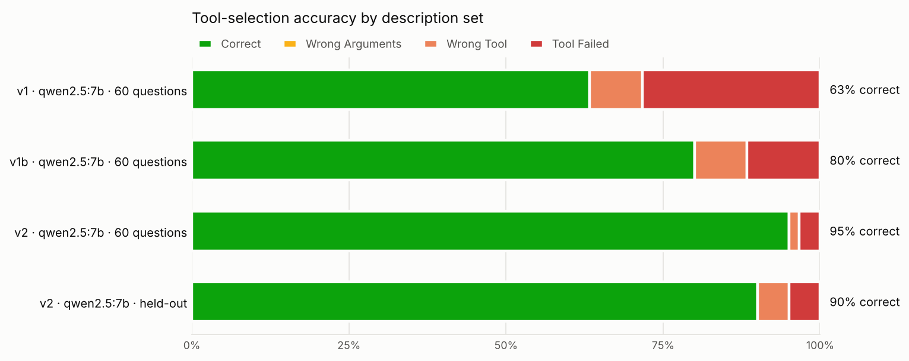
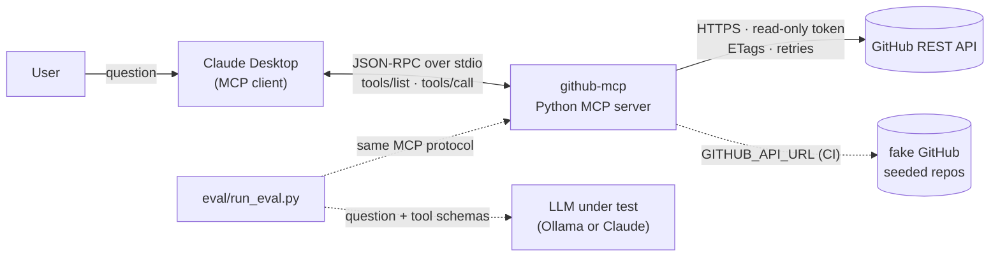

# GitHub MCP Server: Teaching an AI to Pick the Right Tool

[](https://github.com/AbdulMuhaiminKhan/github-mcp/actions/workflows/test.yml)
   

<!-- mcp-name: io.github.AbdulMuhaiminKhan/github-mcp -->

A read-only **Model Context Protocol** server that lets Claude (or any MCP client) answer questions about
my GitHub repos, issues, pull requests and commits. It comes with a **benchmark** that measures how often
the model picks the right tool with the right arguments.

**Rewriting the tool descriptions took a local 7B model from 63% to 95% correct, and from 60% to 90% on
held-out questions it was never tuned on.** An ablation shows where those 32 points came from, and most of them were not the prose:

| Change | Points | What it was |
|---|---|---|
| Accept bare repo names (`mcp-bench-app`, not only `owner/mcp-bench-app`) | **+17** | input handling in the server |
| Write the range `(1-50)` into the `limit` parameter's description | **+8** | one parameter sentence |
| Rewrite the tool descriptions (when to use, when NOT to, and the alternative) | **+7** | the tool wording |

Every miss left in v2 is the model asking for something the API doesn't offer: merged PRs, sorting by
stars, or closed issues from the open-issues tool. Better wording can't fix those. The next step is to support them in the schema.

**[Explore every question in the results dashboard →](https://abdulmuhaiminkhan.github.io/github-mcp/)**



## What I built

- **MCP server (Python, `mcp` SDK 2.x)** with 6 read-only tools over stdio: `list_repositories`,
  `get_repository`, `list_open_issues`, `search_issues`, `list_pull_requests`, `get_recent_commits`.
- **Least-privilege access:** a fine-grained, read-only GitHub token and `readOnlyHint` annotations.
  The token stays in the server process and never reaches the model.
- **Production behaviour:** schema-validated inputs, retries with backoff and jitter, primary and
  secondary rate-limit handling, ETag caching (304s don't count against the rate limit), exact totals
  for list tools, and error messages that tell the model how to recover.
- **A benchmark with known answers:** a seed script creates two repos with 15 issues, 5 pull requests
  and commits from two authors. A fake GitHub API serves the same data offline, so the benchmark also
  runs in CI with no token.
- **Three evaluations:** tool selection with argument grading (60 questions), a held-out set (20), and
  multi-step agent runs whose final answers are checked against the seeded facts (13).
- **An ablation** (`v1 → v1b → v2`) that separates input handling from description wording.
- **An automatic description optimizer** that rewrites descriptions from failures and keeps a change
  only if held-out accuracy doesn't drop.
- **A harness that benchmarks any MCP server**, not just this one ([examples/](examples/)).
- **A results dashboard** ([docs/](docs/index.html)) with every question, call and error from the runs.
- **Tests and CI** on Python 3.10–3.13 (ruff, mypy, pytest, and an oracle check that the harness
  scores 100% when the right call is made).

## Architecture



| Layer | Responsibility |
|---|---|
| `server.py` | Registers tools, validates arguments, returns compact JSON with exact totals |
| `descriptions.py` | Versioned descriptions (`v1` baseline, `v1b` ablation, `v2` optimized, or a JSON file) |
| `github_client.py` | Auth, pagination, retries, rate limits, ETag cache, typed errors |
| `eval/` | Benchmark runner, argument grader, seed script, fake GitHub, optimizer, chart, dashboard export |

## Evaluation

**Method.** Each question goes to the model with the server's own tool list, exactly what Claude
Desktop sends. The harness executes the chosen call through MCP and grades it:

- ✅ **Correct**: expected tool, call succeeded, arguments match (e.g. "last 3 days" → `since_days=3`)
- 🟡 **Wrong Arguments**: right tool, call succeeded, but an argument is wrong or missing
- ⚠️ **Wrong Tool**: a different tool, or no tool
- ❌ **Tool Failed**: right tool, but the call returned an error

There are 60 questions (10 per tool, a third of them in deliberate overlap zones between tools), plus 20
held-out questions written after v2 was frozen and never used for tuning. The data is the seeded
benchmark repos on real GitHub, and the model runs locally with Ollama at temperature 0, 3 runs per
configuration, medians reported. The three runs differed by at most 2 points on the main set and 5 on held-out.

<!-- RESULTS:START -->
| Configuration (qwen2.5:7b) | Correct | Wrong Arguments | Wrong Tool | Tool Failed | Input tokens |
|---|---|---|---|---|---|
| v1: vague descriptions | 63% | 0% | 8% | 28% | 614 |
| v1b: v1 + bare repo names | 80% | 0% | 8% | 12% | 614 |
| v2: rewritten descriptions | 95% | 0% | 2% | 3% | 1533 |
| v1 on held-out questions | 60% | 5% | 15% | 20% | 613 |
| v2 on held-out questions | 90% | 0% | 5% | 5% | 1532 |
<!-- RESULTS:END -->

The offline run against the fake GitHub gave the same picture (65% / 82% / 95%).

**Agent mode** (13 multi-step questions, answers checked against the seeded data): v1 **62%**, v2 **69%**.
With 13 questions one answer is 8 points, so that difference is within noise (offline it went the other way).

**Cost of better descriptions:** v2 adds about **920 input tokens** to every request (614 → 1533).

Raw results, one JSON row per question per run: [`eval/results/`](eval/results/).

## Benchmark your own MCP server

The harness isn't tied to this server. Give it the command that starts any stdio MCP server and a
JSONL file of questions:

```bash
python eval/run_eval.py --server "npx -y @modelcontextprotocol/server-filesystem ." \
    --questions my_questions.jsonl --domain "the user's files" --backend ollama --runs 3
```

[`examples/`](examples/) has a small notes server with 10 questions and the question format.

## Decision File

### 1. Why the model picked the wrong tool

Every wrong-tool pick from the v1b run (3 of 3 runs each), and what v2 did about it:

| Question | Expected → chosen | Root cause | After v2 |
|---|---|---|---|
| "What's the exact name of my portfolio website repo?" | `list_repositories` → `get_repository` | v1's "Gets info about a repo" invited guessing a name (`portfolio-website`) instead of listing | fixed |
| "Which repos haven't I pushed to in a long time?" | `list_repositories` → `get_recent_commits` | "Gets recent activity for a repo" sounded like the answer; nothing said repos can be sorted by last push | fixed |
| "What topics are tagged on mcp-bench-app?" | `get_repository` → `search_issues` | "Searches GitHub" read as a catch-all for anything about a repo | fixed |
| "What's the newest issue someone opened on mcp-bench-app?" | `list_open_issues` → `search_issues` | The model reached for search and invented query syntax (`created:desc`) | fixed |
| "Which issues have been closed in mcp-bench-app?" | `search_issues` → `list_open_issues` | The model passed `state: "closed"` to the open-issues tool, trusting its own argument over the tool's name | **still wrong**, also on held-out |

### 2. What the ablation showed

With an oracle that always picks the right tool, v1 scores 83%: all 10 bare-name questions fail because v1
requires `owner/name`. So part of any v1 → v2 gain was always going to be input handling. `v1b` (v1 text +
bare names) separates the two:

- **v1 → v1b: +17 points.** All 10 bare-name questions went from ❌ to ✅. The wording didn't change at all.
- **v1b → v2: +15 points**, from 9 questions:
  - **5 were one parameter sentence.** v1's `limit` said "How many." The model asked for 100, the schema
    allows 50, and the call failed. v2 says "(1-50)" and those 5 questions pass.
  - **4 were the tool wording**: the first four rows of the table above.

The model rarely picked the wrong tool even with vague descriptions (92% right tool on v1). Most of the
failures came from calls the server rejected.

### 3. What I changed

1. **Each description states what it returns, when to use it, and when NOT to use it, naming the
   alternative**, e.g. `list_open_issues`: *"Do NOT use for closed issues, keyword search, or issues
   across all repos (use search_issues), or for pull requests (use list_pull_requests)."*
2. **Boundaries are mutually exclusive along one axis each:** open vs closed, one repo vs all repos,
   keyword vs none, metadata vs history, issues vs PRs.
3. **Every parameter documents its format and range with an example.** This turned out to matter more
   than the tool text.
4. **Behaviour fixes, reported separately:** bare repo names resolve to the user's repo, and list tools
   return exact totals instead of a page-sized count.
5. **Error messages carry a next step** ("Call list_repositories to check the exact name").

### 4. The automatic optimizer overfit, and the guard caught it

`eval/optimize.py` shows a model its training failures, asks it to rewrite the descriptions, and keeps a
candidate only if training accuracy rises **and** held-out accuracy doesn't drop. Starting from v1, with
qwen2.5:7b rewriting its own tools (offline data, 4 iterations):

| Iteration | Train (60) | Held-out (20) | Kept |
|---|---|---|---|
| 0 (v1) | 65% | 60% | baseline |
| 1 | 70% | 55% | no |
| 2 | 67% | 50% | no |
| 3 | 72% | 40% | no |
| 4 | 72% | 40% | no |

Every rewrite raised training accuracy and lowered held-out accuracy, so the guard rejected all of them.
The 7B model wrote descriptions that fit the questions it had just seen, not the tools. Without the held-out
check, iteration 3 would have looked like a 7-point win. The hand-written v2 is what generalized.

### 5. What's left, and trade-offs

- **The 3 remaining v2 misses all ask for something the API doesn't have:** `state: "merged"` for pull
  requests, `sort: "stars"` for repos, and `state: "closed"` on the open-issues tool. I didn't reword around
  them, because that would tune to these exact questions. The right fix is in the schema: accept `merged`
  (filter on `merged_at`), sort by stars client-side, and let the issues tool take a state.
- **Longer descriptions cost about 920 tokens per request.** That's worth it at 6 tools. With dozens of
  tools I'd move to tool search and deferred loading.
- **Agent mode needs more questions** before its numbers mean anything (13 is too few).
- Pagination stops at 500 items per list (5 pages); totals beyond that are reported as lower bounds.

## Use it

From Claude Desktop, add this to `claude_desktop_config.json` (or point `command` at a local install, as in
[this example](claude_desktop_config.example.json)):

```json
{
  "mcpServers": {
    "github": {
      "command": "uvx",
      "args": ["--from", "git+https://github.com/AbdulMuhaiminKhan/github-mcp", "github-mcp"],
      "env": { "GITHUB_TOKEN": "github_pat_... (fine-grained, read-only)" }
    }
  }
}
```

Or with Docker: `docker build -t github-mcp .`, then
[`claude_desktop_config.docker.example.json`](claude_desktop_config.docker.example.json).
[GUIDE.md](GUIDE.md) covers token permissions, the seed script and the full eval workflow
([WINDOWS.md](WINDOWS.md) for PowerShell).

## Run the benchmark yourself

```bash
python3 -m venv .venv && source .venv/bin/activate
pip install -e '.[dev,eval,plot]'
pytest -q

# No token needed: the offline benchmark repos and a free local model
ollama pull qwen2.5:7b
python eval/run_eval.py --fake-github --toolset v1 --runs 3
python eval/run_eval.py --fake-github --toolset v2 --runs 3
python eval/run_eval.py --fake-github --toolset v2 --questions eval/heldout.jsonl
python eval/run_eval.py --fake-github --mode agent --toolset v2

# Against real GitHub: seed the repos once (see GUIDE.md), then drop --fake-github
python eval/seed_repos.py

# Rebuild the chart and the dashboard from your results
python eval/plot_results.py eval/results/select-*.jsonl -o docs/results.png
python eval/export_dashboard.py
```

## Tech

Python 3.10+ · MCP Python SDK 2.x · httpx · pydantic · GitHub REST API · pytest · ruff · mypy ·
GitHub Actions · Ollama / Anthropic API for evaluation · matplotlib · vanilla JS dashboard
