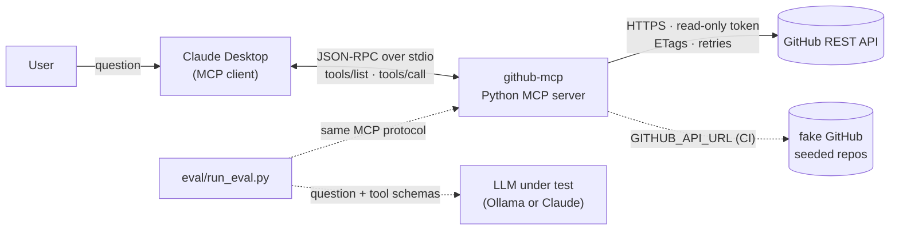

<!--
  BEFORE PUBLISHING: replace every [bracketed] value with numbers from your own eval/results files
  (python eval/run_eval.py --report <file> --markdown), generate docs/results.png with
  eval/plot_results.py, record docs/demo.gif, then delete this comment.
  The career guide's 64% -> 92% figures are illustrative targets. Don't publish them unless you measured them.
  In the Decision File, keep only the confusions your own runs show, with their real counts.
-->

# GitHub MCP Server: Teaching an AI to Pick the Right Tool

[](https://github.com/AbdulMuhaiminKhan/github-mcp/actions/workflows/test.yml)
  

> A read-only **Model Context Protocol** server that lets Claude answer questions about my GitHub
> repos, issues, pull requests and commits, plus a **benchmark** that measures how often the model
> picks the right tool with the right arguments, and how rewriting tool descriptions moved that from
> **[v1]%** to **[v2]%** (**[h]%** on held-out questions).


## What I built

- **MCP server (Python, `mcp` SDK 2.x)** with 6 read-only tools over stdio: `list_repositories`,
  `get_repository`, `list_open_issues`, `search_issues`, `list_pull_requests`, `get_recent_commits`.
- **Least-privilege access:** a fine-grained, read-only GitHub token and `readOnlyHint` annotations.
  The token stays in the server process and never reaches the model.
- **Production behaviour:** schema-validated inputs, retries with backoff and jitter, primary and
  secondary rate-limit handling, ETag caching (304s don't count against the rate limit), exact totals
  for list tools, and error messages that tell the model how to recover.
- **A benchmark with known answers:** a seed script creates two private repos with 15 issues, 5 pull
  requests and commits from two authors; the same data is served offline by a fake GitHub API, so the
  benchmark runs in CI with no token.
- **Three evaluations:** tool selection with argument grading (60 questions), a held-out set (20),
  and multi-step agent runs whose final answers are checked against the seeded facts (13).
- **An ablation** (`v1 → v1b → v2`) that separates the effect of better descriptions from the effect
  of accepting bare repo names.
- **An automatic description optimizer** that rewrites descriptions from failures and keeps a change
  only if held-out accuracy doesn't drop.
- **52 offline tests** and CI on Python 3.10–3.13 (ruff, mypy, pytest, and a 100% oracle check of the
  harness).

## Architecture



| Layer | Responsibility |
|---|---|
| `server.py` | Registers tools, validates arguments, returns compact JSON with exact totals |
| `descriptions.py` | Versioned descriptions (`v1` baseline, `v1b` ablation, `v2` optimized, or a JSON file) |
| `github_client.py` | Auth, pagination, retries, rate limits, ETag cache, typed errors |
| `eval/` | Benchmark runner, argument grader, seed script, fake GitHub, optimizer, chart |

## Evaluation

**Method.** Each question goes to the model with the server's own tool list (exactly what Claude
Desktop sends). The harness executes the chosen call through MCP and grades it:

- ✅ **Correct**: expected tool, call succeeded, arguments match (e.g. "last 3 days" → `since_days=3`)
- 🟡 **Wrong Arguments**: right tool, call succeeded, but an argument is wrong or missing
- ⚠️ **Wrong Tool**: a different tool, or no tool
- ❌ **Tool Failed**: right tool, but the call returned an error

Questions: 60 (10 per tool, a third in deliberate overlap zones between tools), plus 20 held-out
questions written after v2 was frozen and never used for tuning. Data: the seeded benchmark repos.
Model: **qwen2.5:7b via Ollama**, 3 runs per configuration, medians reported. Data source: the
seeded repos on real GitHub (the offline `--fake-github` run gave the same picture: 65% / 82% / 95%).


| Configuration | Correct | Wrong Arguments | Wrong Tool | Tool Failed |
|---|---|---|---|---|
| v1: vague descriptions | 63% | 0% | 8% | 28% |
| v1b: v1 + bare repo names | 80% | 0% | 8% | 12% |
| v2: optimized descriptions | 95% | 0% | 2% | 3% |
| v2 on held-out questions | 90% | 0% | 5% | 5% |
| optimizer's best on held-out | [ ]% | [ ]% | [ ]% | [ ]% |

Agent mode (13 multi-step questions, 1 run, answers checked against the seeded data): v1 **62%**, v2 **69%**.
With 13 questions one answer is 8 points, so this difference is within noise (offline it was 69% vs 62%).
Cost of better descriptions: v2 adds about **920** input tokens per request (1533 vs 614).

Raw results: [`eval/results/`](eval/results/)

## Decision File

### 1. Why the model picked the wrong tool

From the v1b confusion list (`run_eval.py --report`):

| Confusion (expected → chosen) | Count | Root cause |
|---|---|---|
| `list_open_issues` → `get_repository` | [n] | "Gets info about a repo" sounds like it covers issue counts, and the repo object's open-issue count includes PRs |
| `search_issues` → `list_open_issues` | [n] | "Gets issues" vs "Searches GitHub": nothing said which handles closed issues or keywords |
| `list_pull_requests` → `list_open_issues` | [n] | GitHub's own API calls PRs issues; v1 never separated them |
| `get_recent_commits` → `get_repository` | [n] | "Recent activity" overlapped with the repo's last-pushed date |
| [your own finding] | [n] | [explain] |

### 2. What the ablation showed

With an oracle that always picks the right tool, v1 scores 83%: all 10 bare-name questions fail
because v1 requires `owner/name`. So part of any v1 → v2 gain is input handling, not wording.
`v1b` (v1 text + bare names) separates the two: **17 points** came from input handling and
**15 points** from the description rewrite.

### 3. What I changed

1. **Each description states what it returns, when to use it, and when NOT to use it, naming the
   alternative**, e.g. `list_open_issues`: *"Do NOT use for closed issues, keyword search, or issues
   across all repos (use search_issues), or for pull requests (use list_pull_requests)."*
2. **Boundaries are mutually exclusive along one axis each:** open vs closed, one repo vs all repos,
   keyword vs none, metadata vs history, issues vs PRs.
3. **Every parameter documents its format with an example.**
4. **Behaviour fixes, reported separately:** bare repo names resolve to the user's repo; list tools
   return exact totals instead of a page-sized count.
5. **Error messages carry a next step** ("Call list_repositories to check the exact name").

### 4. Trade-offs and next steps

- Longer descriptions cost tokens on every request (about 920 per call here). Worth it at 6 tools;
  with dozens I'd move to tool search and deferred loading.
- The remaining [n] wrong picks are [describe]. I left them because [fixing them would overfit].
- Pagination stops at 500 items per list (5 pages); totals beyond that are reported as lower bounds.

## Run it yourself

```bash
python3 -m venv .venv && source .venv/bin/activate
pip install -e '.[dev,eval,plot]'
pytest -q

# No token needed: the offline benchmark repos and a free local model
ollama pull qwen2.5:7b
python eval/run_eval.py --fake-github --toolset v1 --runs 3
python eval/run_eval.py --fake-github --toolset v2 --runs 3
python eval/run_eval.py --fake-github --toolset v2 --questions eval/heldout.jsonl
python eval/run_eval.py --fake-github --mode agent --toolset v2

# Against real GitHub: seed the repos once (see GUIDE.md), then drop --fake-github
python eval/seed_repos.py
```

Use it from Claude Desktop with [`claude_desktop_config.example.json`](claude_desktop_config.example.json),
or with Docker (`docker build -t github-mcp .`, then
[`claude_desktop_config.docker.example.json`](claude_desktop_config.docker.example.json)).
The full walkthrough is in [GUIDE.md](GUIDE.md) ([WINDOWS.md](WINDOWS.md) for PowerShell).

## Tech

Python 3.10+ · MCP Python SDK 2.x · httpx · pydantic · GitHub REST API · pytest · ruff · mypy ·
GitHub Actions · Ollama / Anthropic API for evaluation · matplotlib
