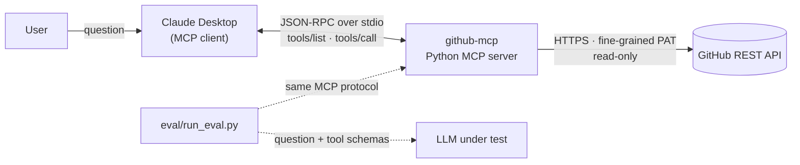

<!--
  HOW TO USE THIS TEMPLATE
  1. Copy to README.md.
  2. Replace every [bracketed] value with numbers from your own eval/results/*.jsonl files.
  3. The 64/22/14 and 92% figures below are the career guide's ILLUSTRATIVE targets.
     Do not publish them unless your runs actually produced them.
  4. Delete this comment.
-->

# GitHub MCP Server — Teaching an AI to Pick the Right Tool


 

> A read-only **Model Context Protocol** server that lets Claude answer questions about my private
> GitHub repos, issues and commits, plus a **50-question benchmark** that measured why the model
> picked the wrong tool and how rewriting tool descriptions raised accuracy from
> **[64]% to [92]%**.


## What I built

- **MCP server (Python, `mcp` SDK 2.x)** exposing 5 read-only tools over stdio:
  `list_repositories`, `get_repository`, `list_open_issues`, `search_issues`, `get_recent_commits`.
- **Authenticated, least-privilege access:** fine-grained GitHub PAT with read-only Metadata,
  Contents and Issues; the token stays in the server process and never reaches the model.
- **Production error handling:** schema-validated inputs, primary and secondary rate-limit handling,
  exponential backoff on 5xx/network errors, and error messages that tell the model how to recover.
- **Evaluation harness** that drives the real server through an LLM, logs every tool choice, and
  classifies each answer as ✅ Correct Tool, ⚠️ Wrong Tool or ❌ Tool Failed.
- **[9] offline tests** running the real MCP server against a fake GitHub API in CI.

## Architecture



| Layer | Responsibility |
|---|---|
| `server.py` | Registers tools, validates arguments, shapes compact JSON for the model |
| `descriptions.py` | Versioned tool descriptions (`v1` baseline, `v2` optimized), switchable via env var |
| `github_client.py` | Auth, retries with jitter, rate-limit handling, typed errors |
| `eval/run_eval.py` | Benchmark runner, outcome classification, before/after comparison |

## Evaluation

**Method.** 50 standardized questions, 10 per tool, a third of them deliberately in the overlap
zones between tools (e.g. "how many open issues" sits between `get_repository` and
`list_open_issues`). For each question the harness starts the server, gives the LLM the server's own
tool list, records the tool it calls, and executes that call against GitHub.
Model: **[claude-opus-5-5 / qwen2.5:7b]**, [3] runs per configuration, median reported.

- ✅ **Correct Tool**: expected tool chosen and the call succeeded
- ⚠️ **Wrong Tool**: a different tool, or no tool, was chosen
- ❌ **Tool Failed**: the right tool, but the call returned an error (bad arguments, not found, rate limit)

### Baseline (v1: vague descriptions)

| Status | Count | Percentage |
|---|---|---|
| ✅ Correct Tool | [32] | **[64]%** |
| ⚠️ Wrong Tool | [11] | [22]% |
| ❌ Tool Failed | [7] | [14]% |

Raw results: [`eval/results/[v1 file].jsonl`](eval/results/)

### Optimized (v2: mutually exclusive, action-specific descriptions)

| Status | Count | Percentage |
|---|---|---|
| ✅ Correct Tool | [46] | **[92]%** |
| ⚠️ Wrong Tool | [3] | [6]% |
| ❌ Tool Failed | [1] | [2]% |

Raw results: [`eval/results/[v2 file].jsonl`](eval/results/) · Held-out set (10 questions written
after tuning): **[h]%** · Regressions vs v1: **[0]**

## Decision File

### 1. Why the model picked the wrong tool

From the baseline confusion list (`run_eval.py --report`):

| Confusion (expected → chosen) | Count | Root cause |
|---|---|---|
| `list_open_issues` → `get_repository` | [n] | "Gets info about a repo" sounds like it covers issue counts, and the repo object has `open_issues_count` (which also counts PRs, so it's wrong even when chosen) |
| `search_issues` → `list_open_issues` | [n] | "Gets issues" vs "Searches GitHub": nothing said which handles closed issues or keywords |
| `list_repositories` → `search_issues` | [n] | "Searches GitHub" invited repo-discovery questions ("my ML repos") |
| `get_recent_commits` → `get_repository` | [n] | "Recent activity" overlapped with the repo's last-pushed date |
| [your own finding] | [n] | [explain] |

The pattern: **v1 descriptions named a noun ("issues", "repo") but no boundary.** When two tools
share a noun, the model has nothing to separate them.

### 2. Why tools failed

| Failure | Count | Root cause |
|---|---|---|
| Bare repo name (`portfolio-site` instead of `[you]/portfolio-site`) | [n] | Parameter described as "The repo." with no format; v1 requires `owner/name` |
| [e.g. 404 on a misspelled repo] | [n] | [explain] |

### 3. What I changed

1. **Each description now states what it returns, when to use it, and when NOT to use it, naming
   the alternative**, e.g. `list_open_issues`: *"Do NOT use for closed issues, keyword search, or
   issues across all repos (use search_issues)."* Each overlapping boundary is written down on both sides.
2. **Boundaries are mutually exclusive along one axis each:** open vs closed, one repo vs all repos,
   keyword vs no keyword, metadata vs history.
3. **Every parameter documents its format with an example** (`'owner/name', e.g. 'octocat/hello-world'`).
4. **Code change, not wording:** bare repo names now resolve to the authenticated user's repo. Users
   talk that way, so the server should accept it. I report this separately because it is a
   behaviour fix, not a description fix; it accounts for [n] of the [x] recovered failures.
5. **Error messages carry a next step** ("Call list_repositories to check the exact name").

### 4. Trade-offs and what I'd do next

- Longer descriptions cost tokens on every request: v2 adds ~[N] input tokens per call. Worth it at
  this tool count; with 50+ tools I'd move to tool search / deferred loading instead.
- The remaining [3] wrong picks are [describe]. I left them because [reason / fixing them would
  overfit the benchmark].
- Next: a `list_pull_requests` tool (PR questions currently have no correct tool), and running the
  benchmark in CI on every description change so accuracy can't silently regress.

## Run it yourself

```bash
python3 -m venv .venv && source .venv/bin/activate
pip install -e '.[dev,eval]'
cp .env.example .env            # add a read-only fine-grained PAT and two repos to test on
pytest -q

# $0 with a local model
ollama pull qwen2.5:7b
python eval/run_eval.py --toolset v1 --backend ollama
python eval/run_eval.py --toolset v2 --backend ollama
python eval/run_eval.py --compare eval/results/<v1>.jsonl eval/results/<v2>.jsonl
```

Claude Desktop config: see [`claude_desktop_config.example.json`](claude_desktop_config.example.json).

## Tech

Python 3.10+ · MCP Python SDK 2.x · httpx · pydantic · GitHub REST API · pytest ·
Anthropic API / Ollama for evaluation
